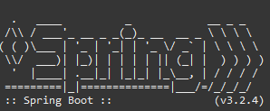

# 0486_AEA3 - Visita Medica

Este repositorio contiene la practica de acceso a datos utilizando JPA e Hibernate a traves de una API REST elaborada con Spring Boot.

## Arquitectura

El proyecto esta construido siguiendo los principios de la Arquitectura Limpia, dividiendo la aplicacion en tres capas:

- **Domain**: Contiene la entidad pura que modela la `VisitaMedica`.
- **Application**: Contiene los servicios y casos de uso de la aplicacion que manejan la logica.
- **Infrastructure**: Contiene la conexion con la base de datos (repositorios JPA), las entidades de Hibernate y el controlador REST.

## Base de datos

La aplicacion incluye una base de datos H2 en memoria para poder probar y desplegar el codigo rapidamente. Se ha configurado para que la tabla `VisitesMediques` se autogenere con todas las restricciones que se pedian (limites de caracteres y restricciones de nulos).

## Como ejecutarlo

Se puede arrancar directamente ejecutando la clase principal `Aea3Application.java` dentro de cualquier IDE compatible con Java y Spring Boot como Eclipse o IntelliJ. 
